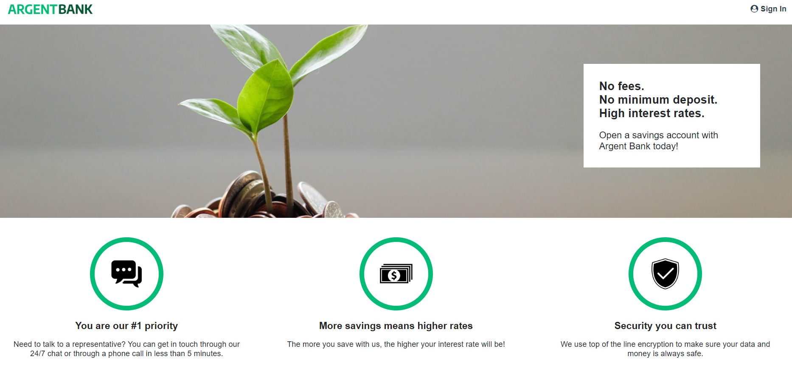

# Argent Bank App

## Presentation:

### phase 1 :

User authentification with JWT token and profile update handling.
Issues [here](https://github.com/OpenClassrooms-Student-Center/Project-10-Bank-API/tree/master/.github/ISSUE_TEMPLATE)

### phase 2 :

Design of API models for endpoints for transactions module.
Yaml Swagger file [here](https://github.com/ZhannaZucher/argent-bank/blob/master/swagger.yaml)

## Project setup

1. Install the source code to run the API forking and cloning it from [here](https://github.com/OpenClassrooms-Student-Center/Project-10-Bank-API)

2. Clone the UI source code [here](https://github.com/ZhannaZucher/argent-bank.git)

### 1. Backend :

Follow instructions to launch the API disponible in Backend repo [README](https://github.com/OpenClassrooms-Student-Center/Project-10-Bank-API/blob/master/README.md).

Install the dependencies with <code>npm install</code> command in the terminal.

Populate database with two users <code>npm run populate-db</code>.

Start local dev server <code>npm run dev:server</code>

Your server should now be running at http://localhost:3001 and you will now have two users in your MongoDB database.

To learn more about how the API works, once you have started your local environment, you can visit: http://localhost:3001/api-docs

### 2. Frontend :

Install the dependencies with <code>npm install</code> command in the terminal.

The run the app in dev mode with <code>npm start</code> command in the terminal which opens the disponible port [http://localhost:3000](http://localhost:3000).
